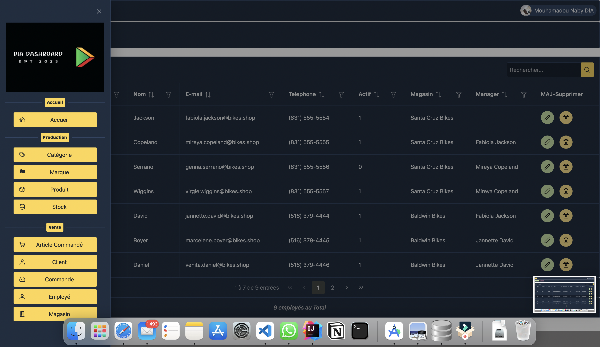
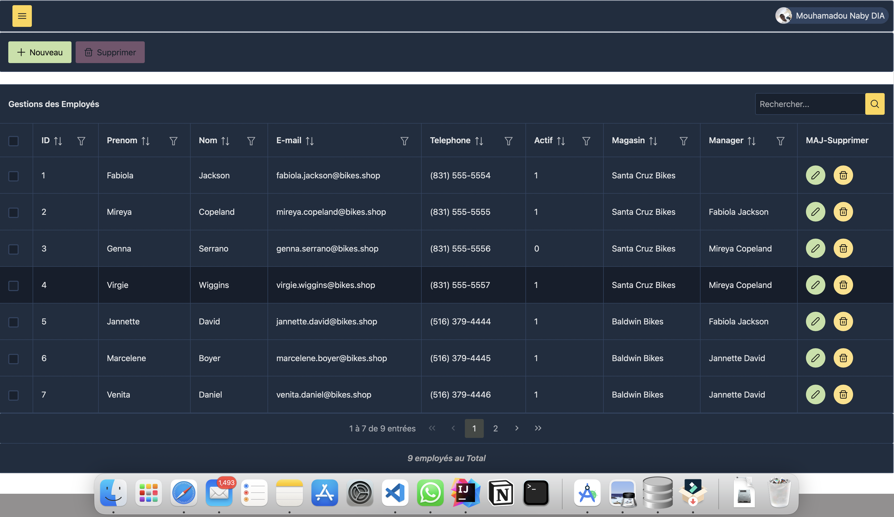
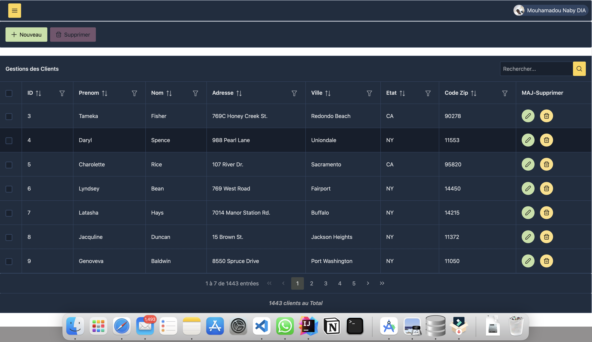

# Angular

Ceci représente un client angular qui consomme un service web mis en place avec Jakarta EE dans le cadre du projet du cours de J2E.

[Complete Demo](https://drive.google.com/file/d/1rU75WlSSbSN83gdDAUZ_i9IrBZ0G9m9o/view?usp=share_link)

## Images

